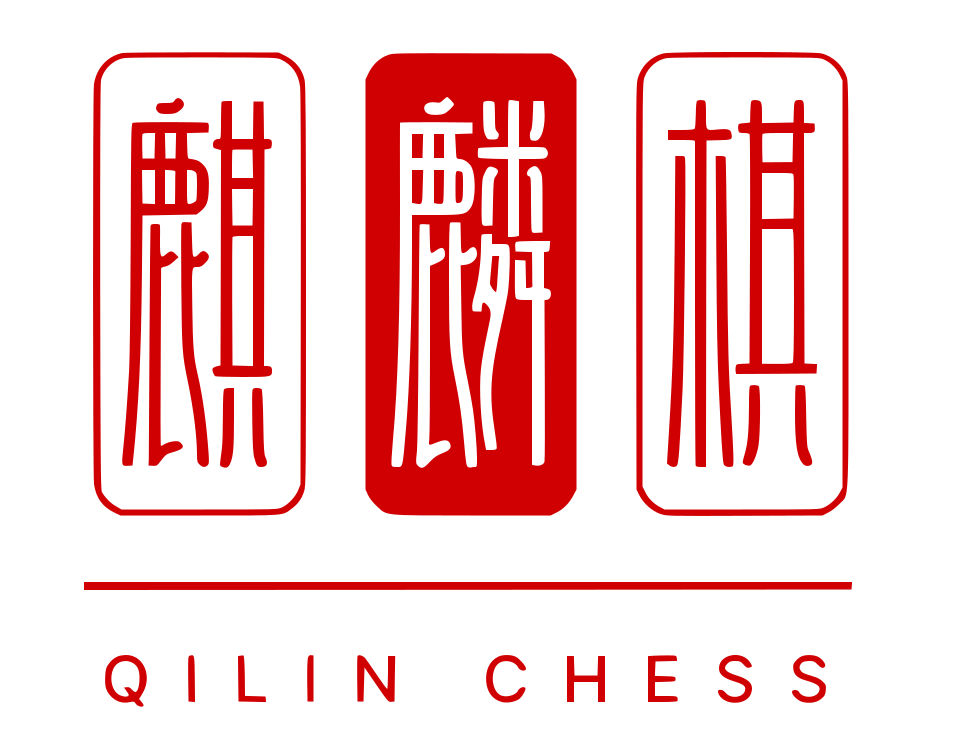
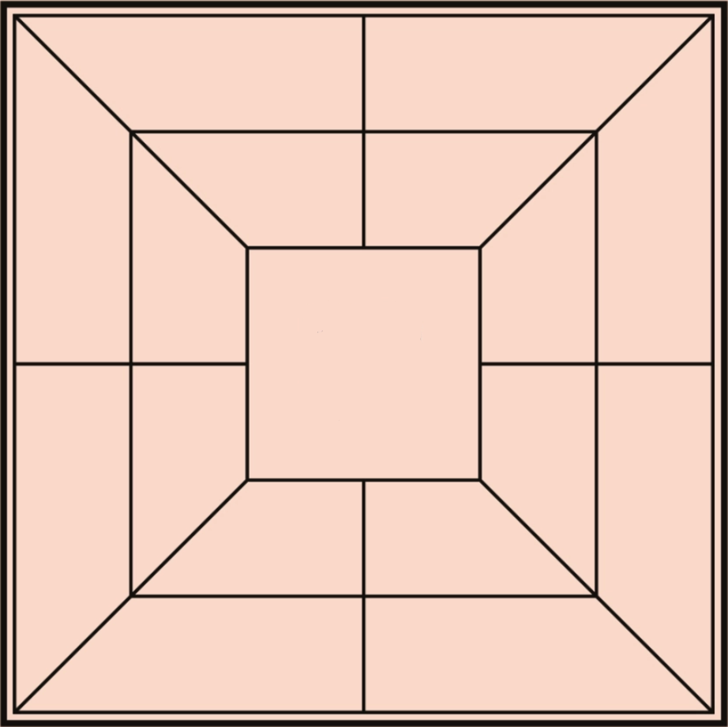

# Qilin Chess

  

[Qilin Chess](https://baike.baidu.com/item/%E9%BA%92%E9%BA%9F%E6%A3%8B/58965173) is based on the national intangible cultural heritage project **"Haifeng Qilin Dance"** in Shanwei City. The front view and side view of the Qilin are used to distinguish the `red` and `black` sides, so it is named "Qilin Chess". There are two ways to play Qilin chess, `"XiaSanZi"` and `"XingJiuGong"`.

Qilin Chess' XiaSanZi is based on [ChengSan Chess](https://baike.baidu.com/item/%E6%88%90%E4%B8%89%E6%A3%8B/241145?fromModule=lemma_inlink) and XingJiuGong is based on [LiuZiChong Chess](https://baike.baidu.com/item/%E5%85%AD%E5%AD%90%E5%86%B2%E6%A3%8B/15738197?fromModule=lemma_inlink).

This project is an implementation of Qilin Chess' **XiaSanZi**.

## T06_QilinChess_01
- Bruno Huang (up202207517) - 50%
- Ricardo Yang (up202208465) - 50%

## Brief description of the tasks each one performed
We collaborated on the entire game development process, continuously exchanging ideas and feedback to ensure a cohesive and well-rounded implementation.

## Installation and Execution

### Pre-Requesites
- Have [SICStus Prolog](https://sicstus.sics.se/) installed.
- The game was tested with **SICStus Prolog VC16 4.9.0**.

### Windows SICStus Prolog Console
- **Font:** Andale Mono
- **Font Style:** Regular
- **Size:** 12
- Note: Although the game includes some simple color features, the console may not support displaying colors.

### Linux SICStus Prolog (using eclipse)
- Ensure it has [ANSI Support](https://help.eclipse.org/latest/index.jsp?topic=%2Forg.eclipse.jdt.doc.user%2Freference%2Fpreferences%2Frun-debug%2Fref-console_ansi.htm) is enabled, as the game includes some simple color features. If ANSI support is not enabled, the console may display some unusual characters instead of rendering colors correctly.

### Execution
1. Run SICStus Prolog console.
2. Navigate to `/src` folder.
3. Run `consult('path_to/src/game.pl').`.
4. To start the game run `play.`, it will display the game menu.

## Game Rules
- `2 players` (red and black).

     

- The chessboard is composed of three nested squares and lines connecting the centers of the sides of the squares.

    

- There are `24 spots` on the chessboard where you can place your pieces.
- Each side has `18 chess pieces`.
- Game is divided into **`2 main stages`**, the `play stage` and the `move stage`, and **1 secondary stage**, the `transition stage`.

### First Stage (Play Stage)
- `Red Starts`.
- Each player has 18 chess pieces and `takes turns` placing them at the **intersection of the line segments**.
- If one side has `3 chess pieces` arranged in a `straight line` (`vertical`, `horizontal` or `diagonal`) it can **`Press Down`** any chess piece of the other side. By pressing down means stacking a piece on top of any of the adversary's chess piece on board.
- The pressed piece **DOES NOT BELONG** to any side, it can't form a straight line with any other chess piece.
- **Stage end:**
    - When all `24 positions` are `filled` the first stage ends and the pressed pieces (both of the stack) are `removed` from the board.
    - If there is `no pressed piece` on board, both sides take `1 piece out` from the board.

### Transition Stage
- When First Stage ends, the `pressed pieces` (both of the stack) are `removed` from the board.
- If there is `no pressed piece` on board, both sides take `1 piece out` from the board, starting with `Red`.
- **Stage end:**
    - When the pieces are removed the transition stage ends.

### Second Stage (Move Stage)
- `Black Starts`.
- Both sides take turns to `move` the chess pieces to the `empty postitions` on the chessboard.
- By aligning `3` of its pieces in a `straight line`, a player can `remove` 1 opposing piece from the board.
- **Stage end:**
    - The game ends when one player has `no pieces left` on the board.

## Considerations for game extensions
Since the game rules were not fully detailed, we added some rules that we believed were more logical based on the information available. Specifically, in the first stage, we allowed pressing more than once when forming 2 or 3 lines with a single move. In the second stage, we allowed players to move pieces from the lines they had formed.

## Game Logic

### Game Configuration Representation
The game can be started in either `Human vs Human` or `Human vs Computer` mode. 

In the case of `Human vs Computer`, the user can choose the difficulty level (easy/hard) and the player color (red/black). 

The `start_game(+Player1Type, +Player2Type)` function receives these choices in the respective order. For example, if the user chooses the hard difficulty level and wants to play as the red player, the function call will be `start_game(human, computer-2)`, where `2` represents the hard difficulty level. If the user chooses to play as the black player, the function call will be `start_game(computer-2, human)`.

The `initial_state(+GameConfig, -GameState)` function receives a list of player types `[Player1Type, Player2Type]`, initializes the game state, and outputs it as `game_state(+PlayerTypes, +Stage, +Board, +CurrentPlayer, +Pieces, +Lines, +AllowRewardMoveCount)`.

### Internal Game State Representation
The game state is represented by the `display(+GameState)` function. It draws a box showing the current game stage, followed by a hardcoded board with dynamic cells. The `print_cell(+Board, +Position)` function is used to render each cell. This function checks if the `Position-Cell` exists in the `Board`. If it does, it calls `print_cell_content(+Cell)`, which prints `#` for an empty cell, `R` for a red piece, `B` for a black piece, and `P` for a pressed piece. Below the board, another box is displayed, showing the current player.

The `update_board(+Board, +Move, +NewState, +NewBoard)` function allows us to update the cells on the board, changing `Position-Cell` to `Position-NewState`. The `NewState` can represent a red piece, black piece, pressed piece, or an empty cell. The next time `display(+GameState)` is called, it will render the updated board.

**Include examples of representations of initial, intermediate, and
final game states IMAGES HERE**

### Move Representation
Initially, we needed to use the `valid_moves(+GameState, -ListOfMoves)` function to obtain the valid moves. 

#### Human Move
For human players, when reading moves, we implemented a repeat loop to validate the input using the `validate_input(+Input, -Output)` function. 

This function checks that the input is instantiated (`nonvar(Input)`) and is either an atom (`atom(Input)`) or a number (`number(Input)`). We added this validation to handle Prolog's backtracking behavior. During the implementation of I/O-related functions and features, backtracking would sometimes pass uninstantiated variables to certain functions. 

If the received input was uninstantiated, it would cause the function receiving it to run its first instance, so we needed to prevent that by ensuring the input was valid.

The `process_move(+Input, +ValidMoves, +Move, +GameState)` function further processes the move by re-validating the input. Depending on the length of the move, it handles different stages of the game. For example, in the first stage, it processes moves like `a1` to place pieces, while in the second stage, it processes moves like `a1a4` to move pieces from `a1` to `a4`. It checks if the position is on the board, empty, and a member of `ValidMoves`. 

In the second stage, `ValidMoves` finds all pieces of the `CurrentPlayer` on the board and uses `adjacent_position(+From, +To)` to check the empty cells adjacent to each piece. For example, if `a1` is a `CurrentPlayer` piece and `a4` is empty, a valid move in the list would be `a1a4`.

After moving a piece, whether placing it in the first stage or moving it in the second stage, the `check_lines_formed(+Simulation, +PlayerType, +Stage, +Move, +Board, +Player, +ExistingLines, -UpdatedLines, -NewLineCount)` function checks the lines formed by the player after the move. It updates the already formed lines (`ExistingLines`) with the new lines, and `NewLineCount` represents the number of reward moves the player gained, either pressing in the first stage or removing in the second stage.

The `valid_moves(+GameState, -ListOfMoves)` function returns different moves when the `AllowRewardMoveCount` from `GameState` is greater than 0. In both stages, it returns all the opponent's pieces. In case of transition stage and no pressed pieces are found it returns the player own pieces to be able to remove.

#### Computer Move
Computer moves are handled by the `choose_move(+Level, +GameState, +ValidMoves, -Move)` function. 

- In level 1 (easy mode), it randomly selects a move from `ValidMoves` using Prolog's `random_select/3`, which is imported with `:- use_module(library(random)).`.

- In level 2 (hard mode), it simulates every possible move from `ValidMoves` and assigns a value to each move using the `value(+SimulatedGameState, +CurrentPlayer, +Value)` function. This function analyzes the board and assigns points based on the game stage. 

  - In the first stage, it awards 10 points for each line formed, 2 points for each potential line, and penalyzes 5 points for each opponent's potential line. This prioritizes forming lines to gain reward moves, defensively prevents the opponent from forming lines, and lastly, tries to form lines.
  
  - In the second stage, it also considers the mobility of both the player and the opponent. The move must not leave the player with no valid moves in the next round, as that would result in a game over.

The function then sorts the list of `MoveValues`, where each element is `Value-Move`, in descending order and selects the move with the highest value. If there are multiple moves with the highest value, it randomly selects one from those moves.

### User Interaction
Using the `validate_input(+Input, -Output)` function along with repeat-fail loops and `catch(read, _, handle_error)`, we prevent Prolog's error messages from being displayed in case of invalid symbol inputs. Additionally, for uppercase inputs (considered as variables), we ensure that the functions do not run with a variable but correctly with an atom or number.

### Stage Transition
In `first_stage_loop(+GameState)`, we check for `first_stage_over(+GameState, -Transition)` to determine if the board is completely filled. If it is, we proceed to remove pressed pieces using the `remove_all_pressed(+Board, -BoardWithoutPressed, -PressedFound)` function. If `PressedFound` returns false, we enter a small transition stage where players remove pieces. 

This is done using `choose_piece_to_remove(+GameState, +PlayerType, -GameStateAfterRedRemoval)` and `choose_piece_to_remove(+TempGameState, +NextPlayerType, -GameStateAfterBlackRemoval)`. Here, `PlayerType` represents either a human or a computer with a specified level. The respective moves are handled by `choose_move(+GameState, +PlayerType, -Move)` for the computer and `read_move(+GameState, -Move)` for the human player.

### Game Over
In `second_stage_loop(+GameState)`, we check for `game_over(+GameState, -Winner)` to determine if the game has ended. This function checks the `Pieces` in `GameState`, and if one of them is 0, it signifies game over. The representation of `Pieces` varies between the first and second stages. In the first stage, it represents the number of pieces the player has left to place. Before entering the second stage, it changes to represent the number of pieces on the board using `count_pieces(+Board, +Player, -Count)`.

The official rule for game end is when one side has no pieces remaining. However, as the rules state, a player can remove an opponent's piece from the board when they form a line of three. If a player's remaining piece count is 2, it becomes impossible to form a line, rendering their moves purposeless. To address this, we added a `forfeit.` command that can be input when prompted for a move. This command allows the player to forfeit, declaring the opponent as the winner.

### Save and Load Game State
In addition to the `forfeit.` command, we allow the user to input the `save.` command to save the current game state to a file. The filename is provided by the user, and the game state is saved using `save_game(+GameState)`. The file is stored in the working directory, which is printed when running the `save.` command. The working directory can be changed by running `prolog:set_current_directory('directory_path').` After saving, the game returns to the menu, and the saved state can be loaded using the 4th option in the menu, `Load Game` (`load_game(+GameState)`), which resumes the game from where it was left off.

Due to the way reward moves are processed, we do not allow the `forfeit.` or `save.` commands when input is being requested for reward moves or during the transition stage. These commands can be used in the first stage when placing a piece or in the second stage when moving a piece.

## Conclusions

### Work Carried Out
The development of Qilin Chess involved implementing the core game mechanics, including piece placement, movement, and line formation. We also added features to handle different game stages, validate moves, and manage game state transitions. The game supports both Human vs Human and Human vs Computer modes, with two difficulty levels for the computer player.

### Limitations and Known Issues
1. **Limited AI Strategy**: The AI strategy, especially in hard mode, could be further improved. Currently, it uses a basic evaluation function to determine the best move based on the current board state. However, it does not predict the opponent's subsequent moves, which limits its effectiveness.
2. **User Interface**: The game runs in a text-based console, which limits the user experience. A graphical user interface (GUI) could make the game more engaging and easier to play.
3. **Error Handling**: While we have implemented basic error handling to manage invalid inputs, there may still be edge cases that are not covered. More robust error handling and user feedback mechanisms could be added.
4. **Game Rules**: Some game rules were inferred or added based on logical assumptions due to incomplete documentation. This might lead to discrepancies with the official rules.

### Possible Improvements and Future Developments
1. **Enhanced AI**: Implement more advanced AI algorithms to improve the computer player's decision-making process.
2. **Graphical User Interface**: Develop a GUI to enhance the user experience.
3. **Comprehensive Testing**: Conduct thorough testing to identify and fix any remaining bugs or edge cases, ensuring a more stable and reliable game.
4. **Rule Customization**: Allow players to customize game rules and settings to accommodate different variations of Qilin Chess.
5. **Detailed Documentation**: Provide more detailed documentation and tutorials to help new players understand the game mechanics and rules.

### Challenges Encountered
While developing the game in Prolog, we encountered several challenges due to Prolog's backtracking mechanism. For instance, a single mistake in a word or variable could cause the program to run and display an error in a different function that was otherwise working correctly. This made debugging more difficult, even with the use of `trace`. As the development progressed, using `trace` became increasingly challenging because a simple move would trigger the execution of numerous lines of code for printing or validating moves.

Additionally, when implementing the return to menu action, we encountered bugs related to repeat-fail-cut loops. Prolog's backtracking would sometimes send uninstantiated variables to functions, causing them to run unpredictably. To address this, we had to strategically place cuts and fails in different parts of the program to ensure proper control flow and prevent unintended behavior.

When tackling the I/O-related functions, we observed that uppercase inputs would cause errors in the program. With the help of ChatGPT, we attempted to convert the inputs to lowercase. However, we discovered that SICStus Prolog did not support the libraries provided (which were for SWI-Prolog). We then asked the AI to manually implement the conversion, but we still encountered issues with uppercase inputs being considered as variables and backtracking with uninstantiated variables. As a result, we decided to treat uppercase inputs as invalid.

Overall, the project successfully implements the core mechanics of Qilin Chess and provides a solid foundation for future enhancements. With further development, the game can be made more robust, user-friendly, and engaging for a wider audience.

### Bibliography
- [Qilin Chess](https://baike.baidu.com/item/%E9%BA%92%E9%BA%9F%E6%A3%8B/58965173)
- ChatGPT Queries (Most relevant ones):
    - How can I make the pieces display on board dynamically?
    - How can I transitate from the first stage to the second stage of the game?
    - How can I separate a move like a1a4 to a1 and a4 to check positions separately?
    - Refactor this code without using if-else-then conditions nor -> ; operators
    - How to check for lines formed after a move?
    - Based on player types and current player, how to check if current player is computer or human?
    - What are the functions that I can use to save and load a game state?
    - How to show a custom error message instead of prolog error message in case of invalid inputs?
    - How does this cut and fail here makes the loop work correctly?
    - This error is shown after I input like ASD. how to handle this?
    - Help me implement a Press ENTER to continue feature
    - How can I write the value function value(+GameState, +Player, -Value) so it considers forming a line as the priority, then at the same time it should prevent opponent from forming line
    - Without changing the logic, help me improve the readability of the code
    - Why does this happen?