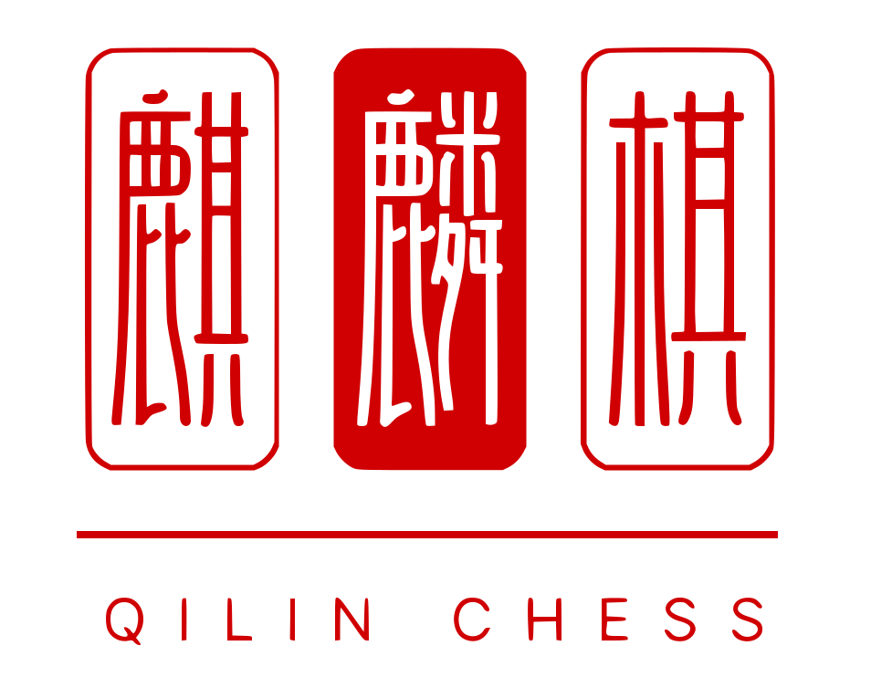

# Qilin Chess

  

[Qilin Chess](https://baike.baidu.com/item/%E9%BA%92%E9%BA%9F%E6%A3%8B/58965173) (麒麟棋) is based on the national intangible cultural heritage project **"Haifeng Qilin Dance"** in Shanwei City. The front view and side view of the Qilin are used to distinguish the `red` and `black` sides. There are two ways to play Qilin chess, `"XiaSanZi"` (下三子) and `"XingJiuGong"` (行九宫).

Qilin Chess' XiaSanZi is based on [ChengSan Chess](https://baike.baidu.com/item/%E6%88%90%E4%B8%89%E6%A3%8B/241145?fromModule=lemma_inlink) is based on [LiuZiChong Chess](https://baike.baidu.com/item/%E5%85%AD%E5%AD%90%E5%86%B2%E6%A3%8B/15738197?fromModule=lemma_inlink).

This project is an implementation of Qilin Chess' XiaSanZi.

## Game Rules

- `2 players` (red and black).

     

- The chessboard is composed of three nested squares and lines connecting the centers of the sides of the squares.

    

- There are `24 spots` on the chessboard where you can place your pieces.
- Each side has `18 chess pieces`.
- Game is divided into **`2 stages`**, the `play stage` and the `move stage`.

### First Stage (Play Stage)
- `Red Starts`.
- Each player has 18 chess pieces and `takes turns` placing them at the **intersection of the line segments**.
- If one side has `3 chess pieces` arranged in a `straight line` (`vertical`, `horizontal` or `diagonal`) it can **`Press Down`** any chess piece of the other side. By pressing down means stacking a piece on top of any of the adversary's chess piece on board.
- The pressed piece **DOES NOT BELONG** to any side, it can't form a straight line with any other chess piece.
- **Stage end:**
    - When all `24 positions` are `filled` the first stage ends and the pressed pieces (both of the stack) are `removed` from the board.
    - If there is `no pressed piece` on board, both sides take `1 piece out` from the board.

### Second Stage (Move Stage)
- `Black Starts`.
- Both sides take turns to `move` the chess pieces to the `empty postitions` on the chessboard.
- By aligning `3` of its pieces in a `straight line`, a player can `remove` 1 opposing piece from the board.
- **Stage end:**
    - The game ends when one player has `no pieces left` on the board.

